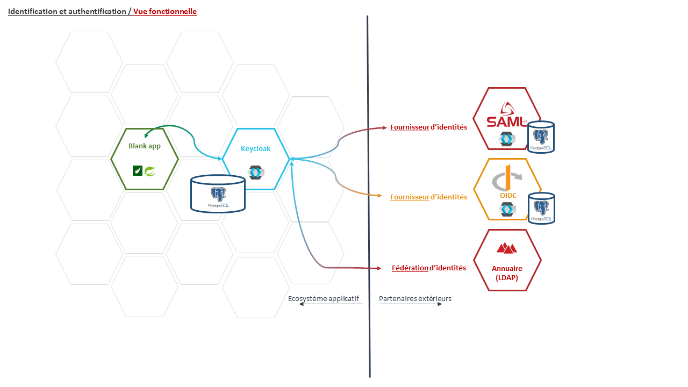
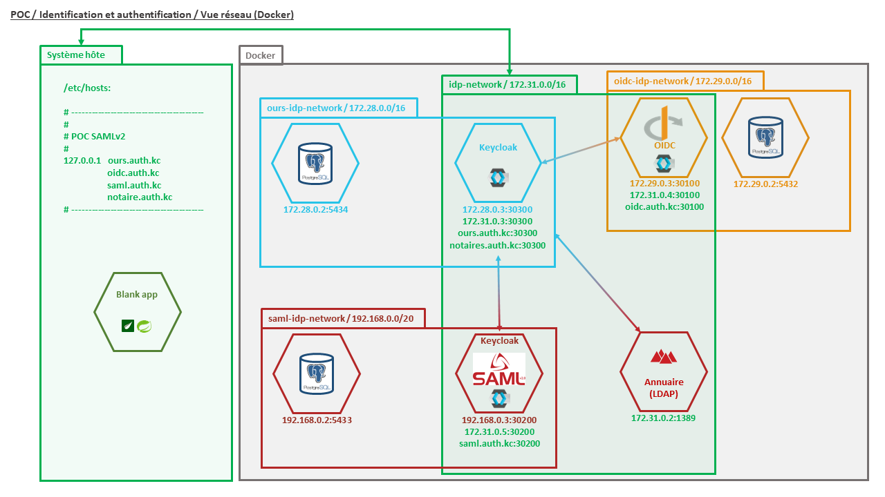
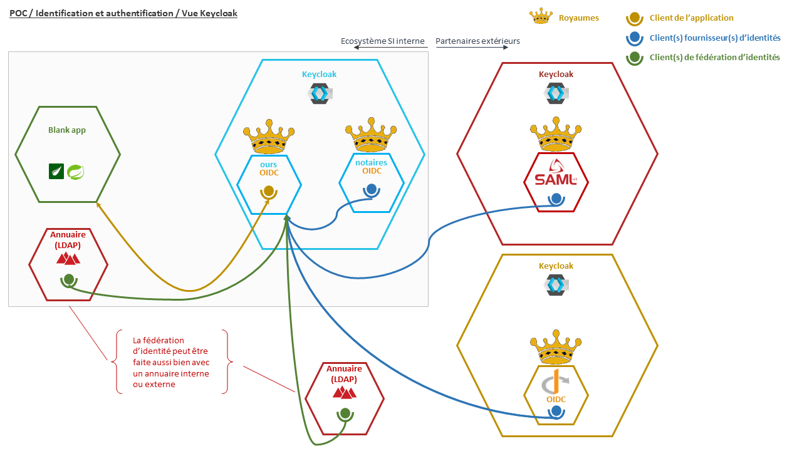
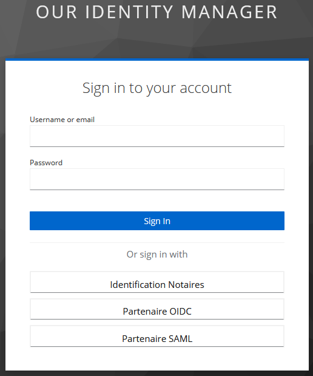

# POC Fournisseurs d'identités externes

L'object de ce POC est de démontrer l'intégrabilité de fournisseurs d'identités tiers selon les protocoles : 
- OpenID Connect, et
- SAML v2,
Ainsi que la possibilité de fédérer des identités par l'intégration d'un annuaire externe

Le POC repose sur la mise en oeuvre de l'outil Keycloak qui fournit nativement ces possibilités.

## Pré-requis

- Docker / Docker compose
- Java 17 (+)
- Maven 3.8.x (+)
- Bash

## Présentation de la solution

### Vision fonctionnelle

 


### Vision Réseau (mise en oeuvre Docker)




### Vision Keycloak (Royaumes / Clients - Idp / Fédération)



## Utilisation

1. Créer un réseau dans Docker : `docker network create --driver=bridge --subnet=172.31.0.0/16 idp-network`
2. Enrichir le fichier hosts (C:\Windows\System32\drivers\etc sous Windows)  de la machine hôte avec : `127.0.0.1   ours.auth.kc oidc.auth.kc saml.auth.kc`
3. Démarrer l'ensemble des containers : `./poc-idps.sh --start all`
4. Importer le fichier `./src/docker/ldap/ldifs/export.ldif` dans l'annuaire ldap :
```
host     : localhost
port     : 1389
bind DN  : cn=admin,dc=autorite,dc=gouv,dc=fr
password : ldapAdmin
```
5. Pour chaque instance keycloak, importer le fichier `./src/docker/{instance name}/realm-export.json`
   _**ATTENTION** : pour l'instance **`ours`** il y deux royaumes à importer !_
6. Pour chaque instance keycloak, créer au moins un utilisateur sans oublier de créer son mot de passe.
7. Mettre à jour la valeur de la propriété `spring.security.oauth2.client.registration.keycloak.client-secret` dans le fichier `src/our-application-to-be-protected/src/main/resources.application.yml`. L'information est disponble dans le royaume `OurApplicationRealm`, client `our-application`, onglet `Credentials`. Par sécurité, il est possible de le re-créer en cliquant sur le bouton [Regenerate].
8. pour éviter tout problème, il peut également être nécessaire de remettre à jour le mot de passe d'accès à l'annuaire ldap dans la partie Fédération d'identité.
9.  démarrer l'application cliente, depuis le dossier `src/our-application-to-be-protected` via la commande `mvn spring-boot:run`
10. Ouvrir l'application dans le navigateur Internet : `http://localhost:8080`

 

 Le clic sur les liens [Secured Area] ou [Connexion] renvoie l'utilisateur sur la page de connexion :

 

 L'utilisateur peut se connecter directement à partir de :
 - l'instance keycloak propre à l'application, ou
 - l'annuaire externe (fédération des identités), ou faire le choix de se connecter via un fournisseur d'identités interne ou externe :
 - Royaume et client interne propres à l'identification des notaires,
 - Partenaire OIDC pour une connexion selon le protocole OpenID Connect, ou
 - Partenaire SAML pour une connexion selon le protocle SAML v2
